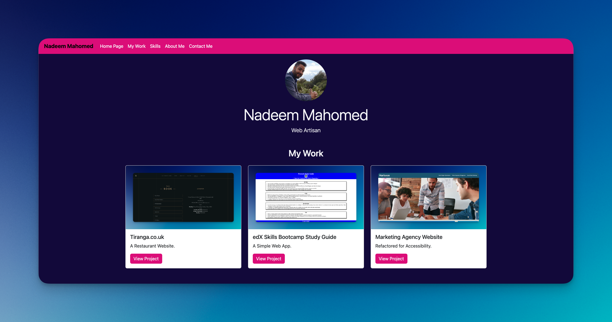

# edX Bootcamp - Module 3 Challenge

## Description

I was tasked to use my newfound Bootstrap skills to recreate/improve my portfolio page, which I can add to as the edX Skills Bootcamp course progresses.

A special challenge was to use a minimum amount of CSS media queries, and instead take advantage of Bootstrap's Grid system. 

Note: I am currently on the Front End Web Developer course.

## Table of Contents

- [Usage](#usage)
- [License](#license)

## Usage

[Click this link to visit the site on Github pages](https://nadeemamdev.github.io/Bootstrap-Portfolio/)

[Click this link to visit the previous site on Github pages, so you can compare my improvements to the previous site](https://nadeemamdev.github.io/module-2-challenge/)

Screenshot of Live Site:

## License

This is a private project and therefore no License has been provided.
